# Alpenglow

Alpenglow is the spiritual successor to the [Afterglow theme](https://github.com/YabataDesign/afterglow-theme), a minimal dark UI theme and syntax color scheme for Sublime Text 2 and 3. The theme is based on the [Spacegray](https://github.com/kkga/spacegray) theme. The syntax color scheme is mostly derived from [idlefingers](http://idlefingers.co.uk/).

**Special thanks** to the following contributors:

- José María Clemente [@YabataDesign](https://github.com/YabataDesign) for designing the original [Afterglow theme](https://github.com/YabataDesign/afterglow-theme) this is based on.
- Max Riveiro [@kavu](https://github.com/kavu) for adding a lot of icons for sidebar to this repository.
- [@vikjam](https://github.com/vikjam) for their work in maintaining the Afterglow theme.


## Table of Contents

- [Design and Colors](#design--colors)
- [Installation](#installation)
- [Activating the Theme](#activating-the-theme)
- [Configuration](#configuration)
- [Color Schemes](#color-schemes)
- [Dock Icon](#dock-icon)
- [Retina Resolution UI](#retina-resolution-ui)


## Design & Colors

#### Alpenglow default

[](../../raw/master/screenshots/Alpenglow-default.png)

#### Alpenglow blue

[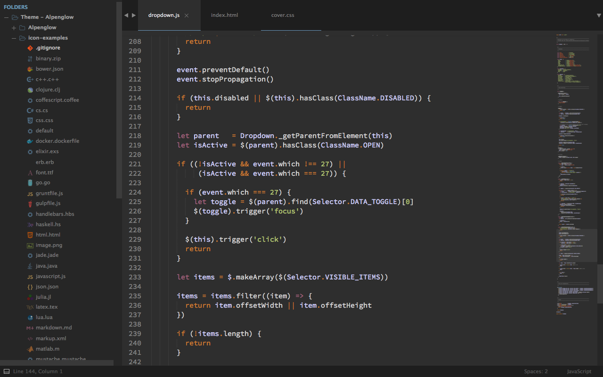](../../raw/master/screenshots/Alpenblow-blue.png)

#### Alpenglow magenta

[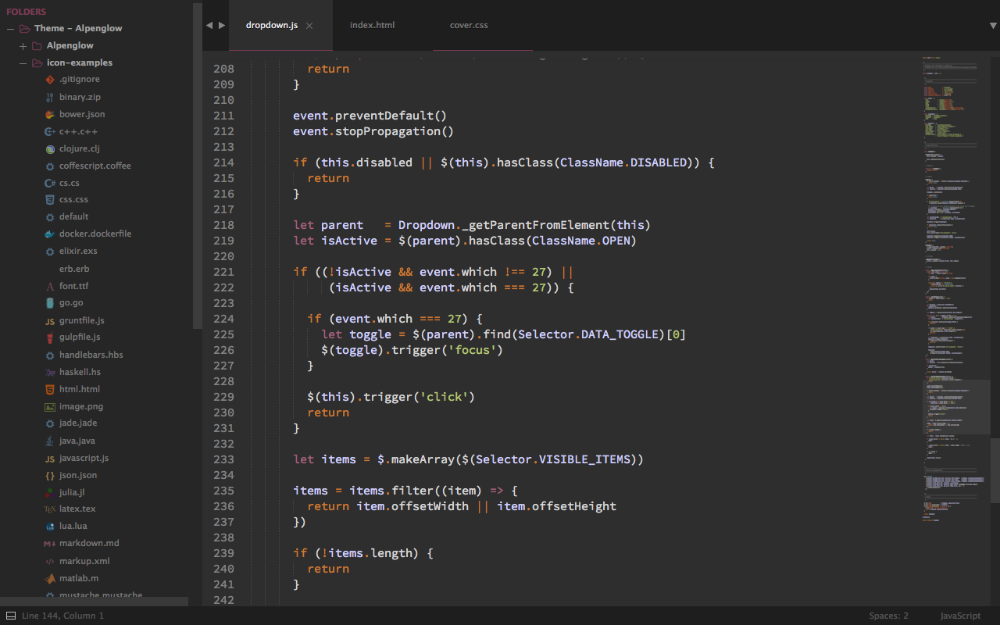](../../raw/master/screenshots/Alpenglow-magenta.png)

#### Alpenglow orange

[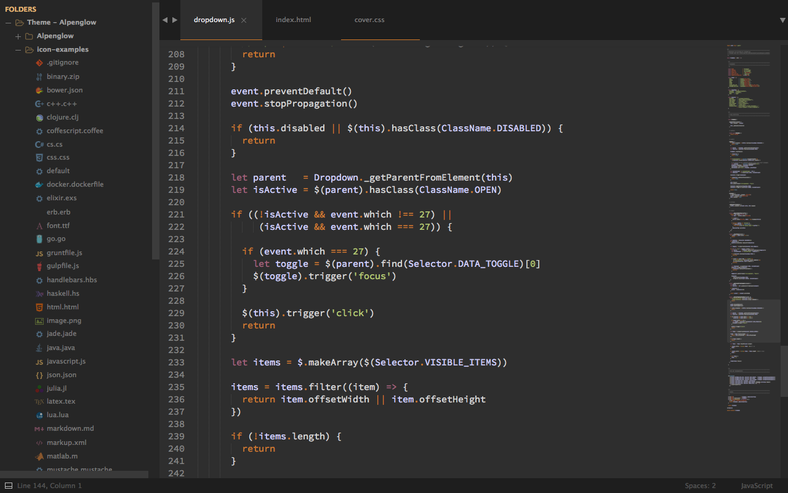](../../raw/master/screenshots/Alpenglow-orange.png)

#### Alpenglow green

[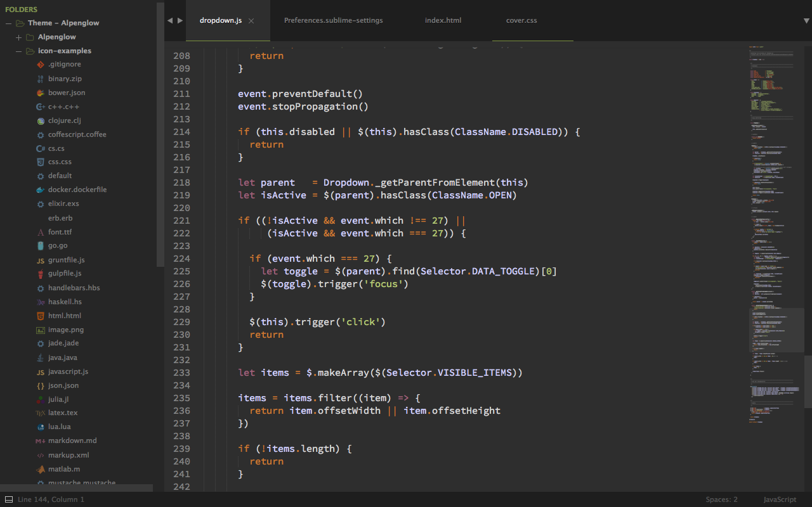](../../raw/master/screenshots/Alpenglow-green.png)

*The font used in the screenshots is [__Source Code Pro__](https://github.com/adobe-fonts/source-code-pro).*


## Installation

### Package Control

The easiest way to install is using [Sublime Package Control](https://sublime.wbond.net/).

* Open `Command Palette` using menu item `Tools -> Command Palette...`, or `Cmd+Shift+P` (OS X) `Ctrl+Shift+P` (Win/Linux)
* Type `Package Control: Install Package`
* Search `Theme - Alpenglow`


### Git Installation

Locate your Sublime Text `Packages directory` by using the menu item `Preferences -> Browse Packages...`.

Then, clone the repository using this command:

    git clone https://github.com/AlpenglowTheme/alpenglow-theme/ "Theme - Alpenglow"


### Manual installation

* Download the [GitHub .zip](https://github.com/AlpenglowTheme/alpenglow-theme/archive/master.zip)
* Unzip the files and rename the folder to `Theme - Alpenglow`
* Find your `Packages` directory using the menu item  `Preferences -> Browse Packages...`
* Copy the folder into your Sublime Text `Packages` directory.


## Activating the Theme

Activate this theme and color scheme by modifying your user preferences file, which you can find using the menu item `Sublime Text -> Preferences -> Settings - User`.

Then add the following code settings, depending on the theme you choose. **(After activating the theme, you must restart Sublime Text.)**

### Settings for Alpenglow

```json
{
    "theme": "Alpenglow.sublime-theme",
    "color_scheme": "Packages/Theme - Alpenglow/Alpenglow.tmTheme"
}
```

### Settings for Alpenglow-blue

```json
{
    "theme": "Alpenglow-blue.sublime-theme",
    "color_scheme": "Packages/Theme - Alpenglow/Alpenglow.tmTheme"
}
```

### Settings for Alpenglow-magenta

```json
{
    "theme": "Alpenglow-magenta.sublime-theme",
    "color_scheme": "Packages/Theme - Alpenglow/Alpenglow.tmTheme"
}
```

### Settings for Alpenglow-orange

```json
{
    "theme": "Alpenglow-orange.sublime-theme",
    "color_scheme": "Packages/Theme - Alpenglow/Alpenglow.tmTheme"
}
```

### Settings for Alpenglow-green

```json
{
    "theme": "Alpenglow-green.sublime-theme",
    "color_scheme": "Packages/Theme - Alpenglow/Alpenglow.tmTheme"
}
```


## Configuration

### Sidebar icons

Alpenglow theme support sidebar icons.


Don't like the icons? Just add this to your preferences file `Sublime Text -> Preferences -> Settings - User`:

```json
{
    "sidebar_no_icon": true
}
```

Don't like the folde icon? Just add this to your preferences file `Sublime Text -> Preferences -> Settings - User`:

```json
{
    "folder_no_icon": true
}
```


### Tab Height Size Options

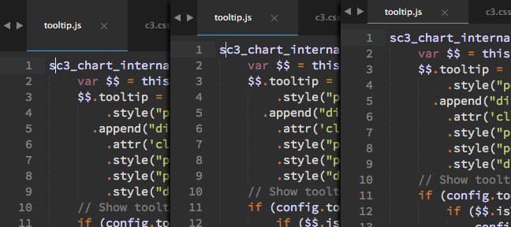

You can change the height of the file tabs (medium or small) by adding either to your preferences file `Sublime Text -> Preferences -> Settings - User`:

```json
{
    "tabs_medium": true
}
```

or

```json
{
    "tabs_small": true
}
```


### Sidebar Size Options

You can change the font size of the sidebar and the row padding.


#### Sidebar font size

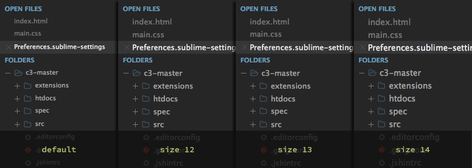

To **change the font size** (12, 13 or 14; default size is 11), you must add this to your preferences file `Sublime Text -> Preferences -> Settings - User`:

```json
{
    "sidebar_size_12": true
}
```

or

```json
{
    "sidebar_size_13": true
}
```

or

```json
{
    "sidebar_size_14": true
}
```


#### Sidebar row padding size

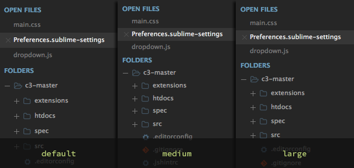

To **change the row padding** (medium or large), you must add this to your preferences file `Sublime Text -> Preferences -> Settings - User`:

```json
{
    "sidebar_row_padding_medium": true
}
```

or

```json
{
    "sidebar_row_padding_large": true
}
```


### Status bar brighter


If you prefer that the status bar has a brighter color, you have to add this in your user preferences file `Sublime Text -> Preferences -> Settings - User`:

```json
{
    "status_bar_brighter": true
}
```


### Color inactive tabs

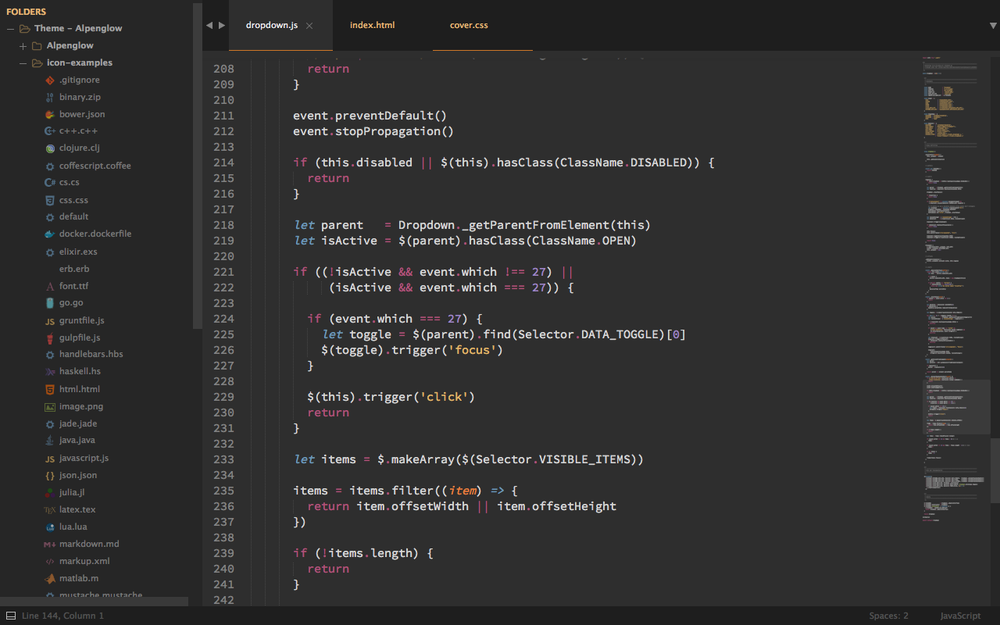

You can highlight the color of inactive tabs, adding this to the user preferences file `Sublime Text -> Preferences -> Settings - User`:

```json
{
    "color_inactive_tabs": true
}
```


### Horizontal padding tabs

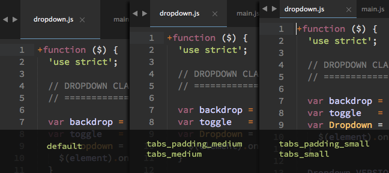

Through the user preferences file, you can modify the horizontal padding of tabs. It works on all three types of height tabs (default, "tabs_medium" and "tabs_small").

You must add this to your user preferences file `Sublime Text -> Preferences -> Settings - User`:

```json
{
    "tabs_padding_medium": true
}
```

or

```json
{
    "tabs_padding_small": true
}
```

### Non-italic tab labels on Windows


On Windows, tab labels are displayed in *italic* font. If you don't like that, you can add this to the user preferences file `Sublime Text -> Preferences -> Settings - User`:

```json
{
    "tabs_label_not_italic": true
}
```


## Color schemes

### Alpenglow - Monokai

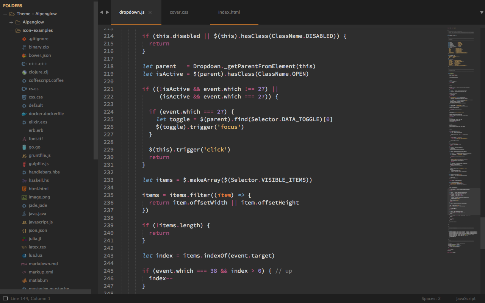

Besides color scheme by default, you can use the color scheme `Alpenglow - Monokai` based on the original `Monokai`, slightly modified to be consistent with the Theme colors.

You must add this in your user preferences file `Sublime Text -> Preferences -> Settings - User`:

```json
{
    "color_scheme": "Packages/Theme - Alpenglow/Alpenglow-monokai.tmTheme"
}
```


### Alpenglow - Twilight

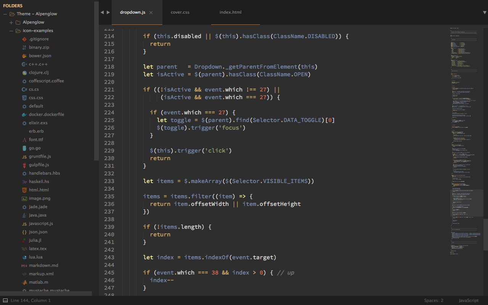

If you prefer, you can use the color scheme `Alpenglow - Twilight` (very slightly modified from the original), adding this to the user preferences file `Sublime Text -> Preferences -> Settings - User`:

```json
{
    "color_scheme": "Packages/Theme - Alpenglow/Alpenglow-twilight.tmTheme"
}
```


### Markdown


This color scheme support **Github Flavored Markdown**.

#### To enable Alpenglow for Markdown

(I highly recommend installing [Sublime Markdown Extending plugin](https://github.com/jonschlinkert/sublime-markdown-extended).)

First, **open a markdown(.md) file**, then navigate to `Sublime Text -> Preferences -> Settings - More -> Syntax Specific - User` in the menu bar.

Add to your current settings or replace with the following:

```json
{
    "color_scheme": "Packages/Theme - Alpenglow/Alpenglow-markdown.tmTheme",
    "draw_centered": true,
    "draw_indent_guides": false,
    "trim_trailing_white_space_on_save": false,
    "word_wrap": true,
    "wrap_width": 80  // Sets the # of characters per line
}
```


## Dock Icon

You can also download a replacement icon for Sublime Text [here](https://github.com/evansendra/sublime-text-icon).


## Retina Resolution UI

Alpenglow Theme supports retina/HiDPI displays.
